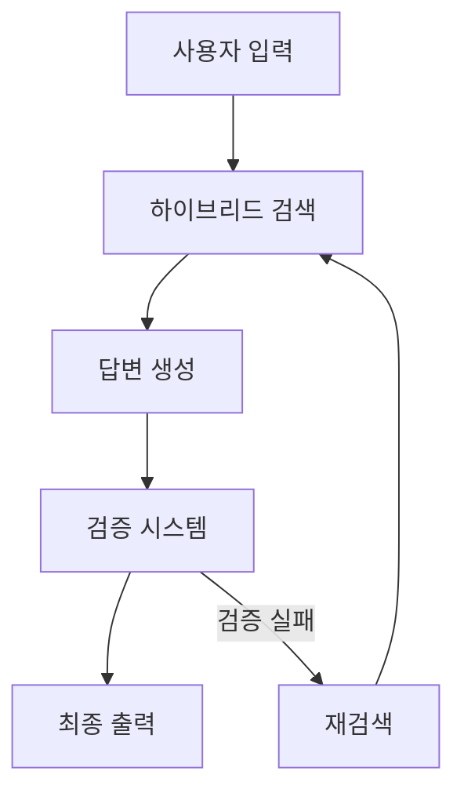

# Legal Assistant Agent Project

## 프로젝트 개요
법률 문서 검색과 질의응답을 위한 싱글 에이전트 기반 시스템입니다. 기존 RAG 시스템을 확장하여 더 정확하고 신뢰할 수 있는 법률 정보 제공을 목표로 합니다.

## 주요 기능


### 1. 하이브리드 검색 시스템
- SOLAR 임베딩 기반 밀집 검색
- KiwiBM25 기반 희소 검색
- 메타데이터 필터링
- 검색 결과 재순위화

### 2. 검증 시스템
- KoBERT 기반 관련성 검증
- Upstage Groundedness 검증
- 결합 점수 계산 및 임계값 기반 필터링

### 3. 메타데이터 활용
```python
metadata_structure = {
    "case_id": "사건 식별자",
    "case_name": "사건명",
    "court_type": "법원 유형",
    "court_name": "법원명",
    "judgment_date": "판결 날짜",
    "case_no": "사건 번호",
    "class_name": "사건 분류",
    "instance_name": "심급",
    "keywords": "키워드",
    "reference_rules": "참조 법령",
    "reference_cases": "참조 판례"
}
```

## 시스템 구조

### 파일 구조
```
liberty_legal/
│
├── app_agent.py           # 메인 애플리케이션
├── app_agent.ipynb        # 테스트용 노트북
├── data_processor.py      # 데이터 처리 및 임베딩
├── search_engine.py       # 검색 및 검증 시스템
├── utils.py              # 유틸리티 함수들
└── requirements.txt      # 의존성 패키지
```

### 주요 컴포넌트
1. **데이터 프로세서**
   - JSON 데이터 로드 및 전처리
   - 임베딩 생성
   - Pinecone 업로드

2. **검색 엔진**
   - 하이브리드 검색
   - 답변 검증
   - 결과 순위화

3. **UI 시스템**
   - Streamlit 기반 인터페이스
   - 채팅 히스토리 관리
   - 세션 상태 관리

## 구현 세부사항

### 1. 데이터 처리
```python
class DataProcessingFeatures:
    """데이터 처리 주요 기능"""
    features = {
        "전처리": [
            "JSON 파일 파싱",
            "메타데이터 추출",
            "텍스트 정제"
        ],
        "임베딩": [
            "SOLAR 임베딩",
            "희소 벡터 생성",
            "벡터 정규화"
        ],
        "저장": [
            "Pinecone 업로드",
            "메타데이터 인덱싱",
            "배치 처리"
        ]
    }
```

### 2. 검색 시스템
```python
class SearchFeatures:
    """검색 시스템 주요 기능"""
    features = {
        "검색": [
            "하이브리드 검색",
            "메타데이터 필터링",
            "결과 재순위화"
        ],
        "검증": [
            "KoBERT 검증",
            "Upstage 검증",
            "결합 점수 계산"
        ],
        "최적화": [
            "캐싱",
            "배치 처리",
            "비동기 처리"
        ]
    }
```

## 성능 지표
1. **검색 정확도**
   - Precision@K
   - Recall@K
   - MRR (Mean Reciprocal Rank)

2. **답변 품질**
   - 검증 점수 (KoBERT + Upstage)
   - 법률 정확성
   - 응답 시간

## 구현 일정
- Week 1:
  - 데이터 처리 및 임베딩 시스템 구축
  - 기본 검색 기능 구현
  - 초기 UI 구현

- Week 2:
  - 검증 시스템 구현
  - 성능 최적화
  - 테스트 및 디버깅

## 기술 스택
- Python 3.11
- Streamlit
- Pinecone
- LangChain
- Transformers (KoBERT)
- SOLAR Embedding
- Upstage AI

## 설치 및 실행
```bash
# 환경 설정
pip install -r requirements.txt

# 환경 변수 설정
cp .env.example .env
# .env 파일 편집

# 실행
python app_agent.py
```

## 향후 개선 사항
1. 검색 성능 최적화
2. 메타데이터 활용 강화
3. 법률 용어 사전 통합
4. 판례 네트워크 분석 기능
5. 위험도 평가 시스템

## 라이센스
MIT License

## 기여 방법
1. Fork the repository
2. Create your feature branch
3. Commit your changes
4. Push to the branch
5. Create a new Pull Request

## 연락처
- 프로젝트 관리자: [이름]
- 이메일: [이메일 주소]

---
© 2024 Legal Assistant Agent Project. All rights reserved.