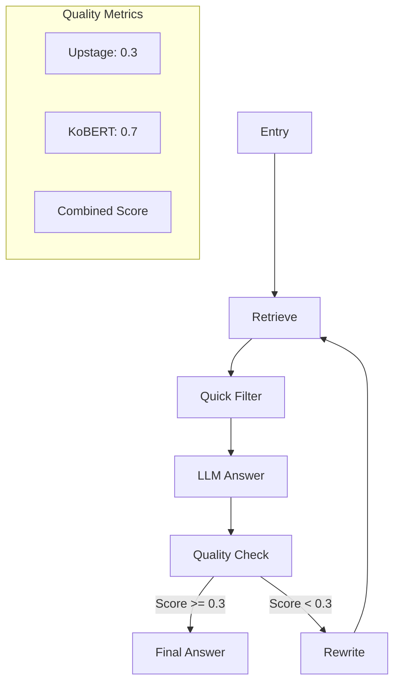

### 📝 README.md

```markdown
# Legal AI Assistant Project

## 🚀 Overview
법률 상담을 위한 AI 어시스턴트 프로젝트입니다. 판례 데이터를 기반으로 사용자의 법률 관련 질문에 대해 정확하고 신뢰할 수 있는 답변을 제공합니다.

## 🛠 Core Technologies
- **검색 엔진**: Pinecone, FAISS
- **임베딩**: Upstage Embeddings, KoBERT
- **하이브리드 검색**: BM25 + Dense Retrieval
- **LLM**: Claude 3.5 Sonnet
- **프레임워크**: Streamlit, LangChain

## 🌟 Key Features
1. **최적화된 검색 시스템**
   - 컨텍스트 품질 기반 동적 가중치
   - 개선된 폴백 메커니즘

2. **강화된 신뢰도 검증**
   - Upstage 검증 (가중치: 0.3)
   - KoBERT 유사도 (가중치: 0.7)
   - 결합 점수 시스템

3. **카테고리별 최적화**
   - 전문화된 프롬프트 템플릿
   - 법률 분야별 컨텍스트
   - 동적 질문 생성

4. **개선된 워크플로우**
   - 재시도 횟수 최적화
   - 품질 검사 체크포인트
   - 실시간 성능 모니터링

## 📊 Project Status
- 전체 진행률: 85%
- 핵심 기능 구현: 90%
- UI/UX: 70%
- 테스트 커버리지: 60%

## 🔄 Updated Agent Flow


## 📋 Installation & Setup
```bash
pip install -r requirements.txt
streamlit run app.py
```

## 🔧 Configuration
```yaml
UPSTAGE_WEIGHT: 0.3
KOBERT_WEIGHT: 0.7
QUALITY_THRESHOLD: 0.2
MAX_RETRIES: 3
```

## 🚀 Improvement Plans
1. 검색 엔진 최적화
   - 초기 검색 품질 향상
   - 카테고리별 가중치 조정
   - 컨텍스트 필터링 강화

2. 재작성 전략 개선
   - 점진적 구체화 방식
   - 템플릿 기반 최적화
   - 피드백 루프 구현

3. 성능 모니터링
   - 실시간 품질 추적
   - 실패 케이스 분석
   - 자동화된 보고 시스템
```

### 📌 주요 기술 스택 상세

```markdown
## 🔍 Search Engine
- Pinecone: 벡터 데이터베이스
- FAISS: 로컬 벡터 검색
- BM25: 스파스 검색
- Hybrid Retrieval: 밀집/희소 벡터 결합

## 🧠 AI/ML
- Upstage Embeddings: 한국어 특화 임베딩
- KoBERT: 한국어 BERT 모델
- Claude 3.5: 메인 LLM
- Custom Reranking: 컨텍스트 기반 재순위화

## 🛠 Infrastructure
- Streamlit: UI 프레임워크
- LangChain: LLM 통합
- SQLite: 메시지 저장
- ThreadPoolExecutor: 병렬 처리
```