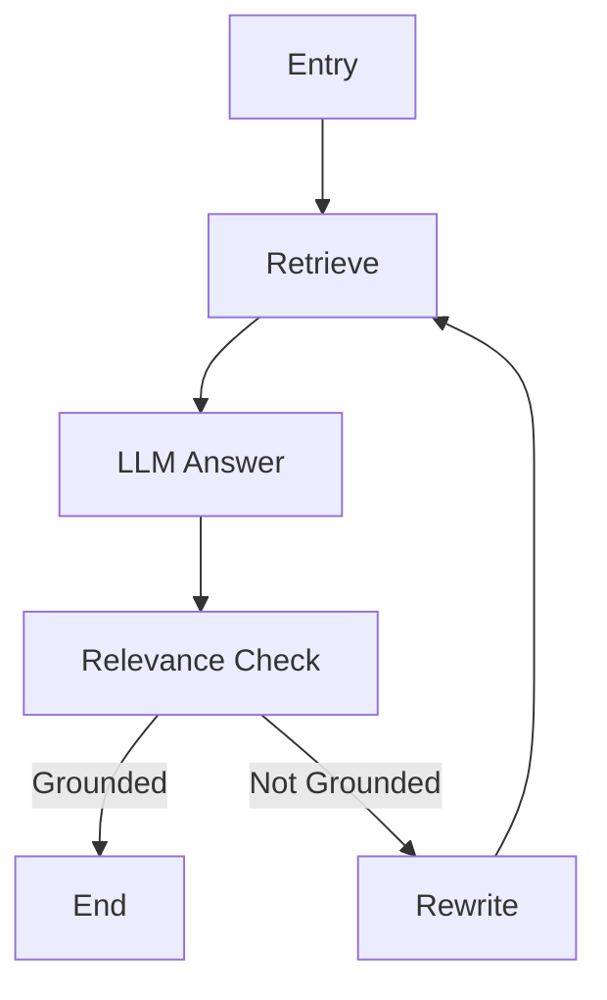

### 📝 README.md

```markdown
# Legal AI Assistant Project

## 🚀 Overview
법률 상담을 위한 AI 어시스턴트 프로젝트입니다. 판례 데이터를 기반으로 사용자의 법률 관련 질문에 대해 정확하고 신뢰할 수 있는 답변을 제공합니다.

## 🛠 Core Technologies
- **검색 엔진**: Pinecone, FAISS
- **임베딩**: Upstage Embeddings, KoBERT
- **하이브리드 검색**: BM25 + Dense Retrieval
- **LLM**: Claude 3.5 Sonnet
- **프레임워크**: Streamlit, LangChain

## 🌟 Key Features
1. **하이브리드 검색 시스템**
   - Dense + Sparse 임베딩 결합
   - 컨텍스트 기반 동적 가중치 조정
   - 폴백 메커니즘

2. **신뢰도 검증 시스템**
   - Upstage 기반 검증
   - KoBERT 유사도 분석
   - 다중 검증 점수 결합

3. **질문 최적화**
   - 질문 재작성
   - 의도 분석
   - 컨텍스트 기반 가중치

4. **데이터 처리**
   - 멀티스레딩 처리
   - 배치 프로세싱
   - 캐싱 시스템

## 📊 Project Status
- 전체 진행률: 85%
- 핵심 기능 구현: 90%
- UI/UX: 70%
- 테스트 커버리지: 60%

## 🔄 Agent Flow


## 📋 Installation & Setup
```bash
pip install -r requirements.txt
streamlit run app.py
```

## 🔧 Configuration
```yaml
PINECONE_API_KEY: your_api_key
OPENAI_API_KEY: your_api_key
MODEL_NAME: gpt-4o
```

## 🚀 Next Steps
1. 컨텍스트 처리 개선
2. 에러 핸들링 강화
3. UI/UX 개선
4. 테스트 자동화
```

### 📌 주요 기술 스택 상세

```markdown
## 🔍 Search Engine
- Pinecone: 벡터 데이터베이스
- FAISS: 로컬 벡터 검색
- BM25: 스파스 검색
- Hybrid Retrieval: 밀집/희소 벡터 결합

## 🧠 AI/ML
- Upstage Embeddings: 한국어 특화 임베딩
- KoBERT: 한국어 BERT 모델
- Claude 3.5: 메인 LLM
- Custom Reranking: 컨텍스트 기반 재순위화

## 🛠 Infrastructure
- Streamlit: UI 프레임워크
- LangChain: LLM 통합
- SQLite: 메시지 저장
- ThreadPoolExecutor: 병렬 처리
```